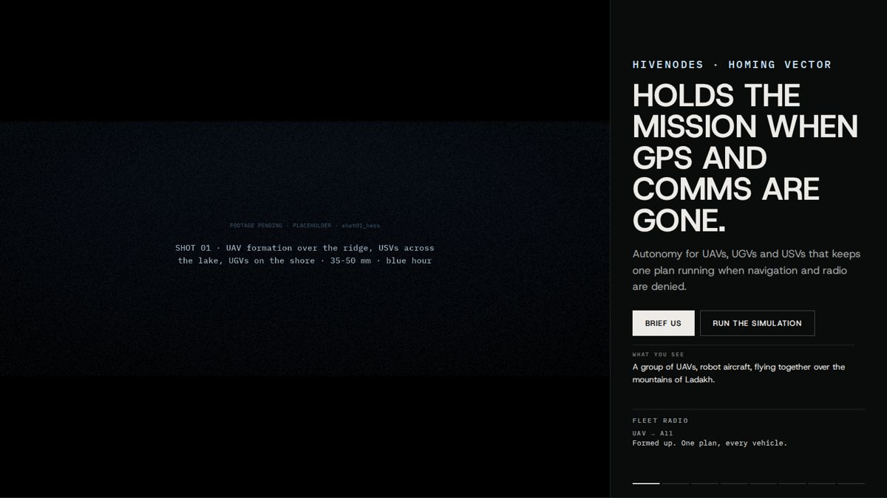
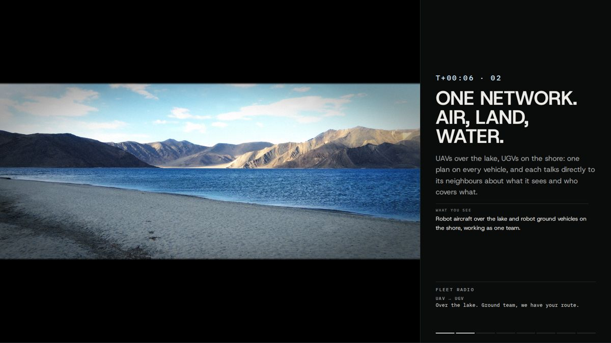
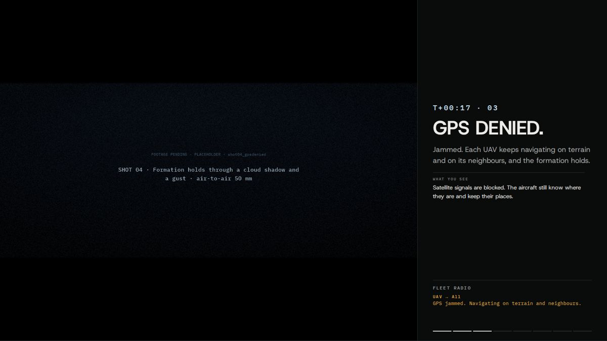
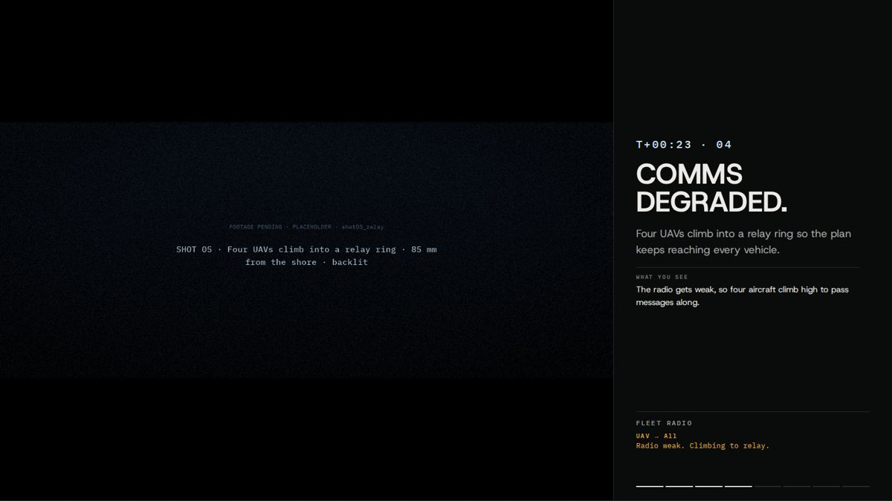
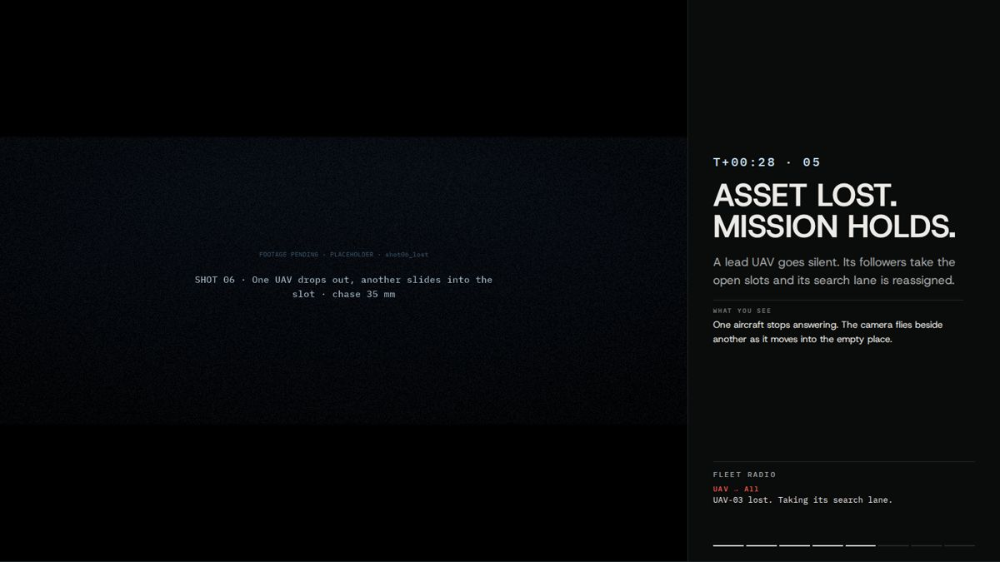
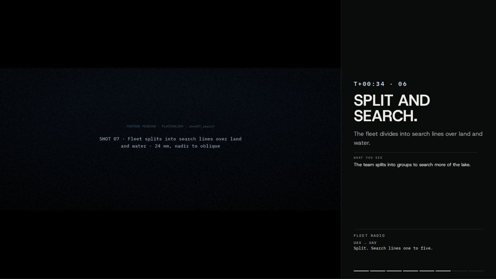
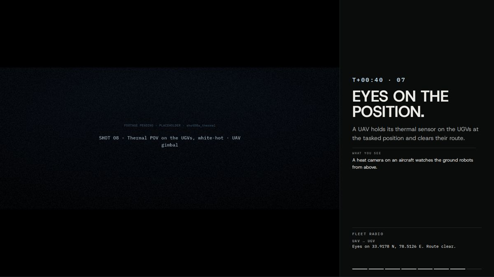
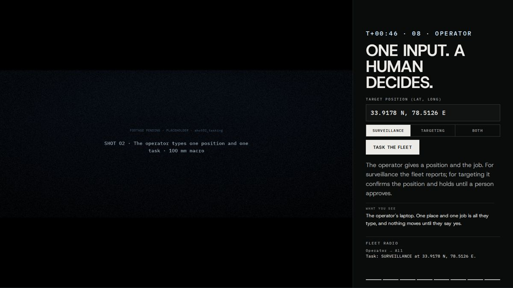
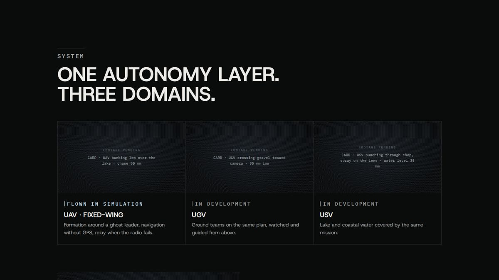
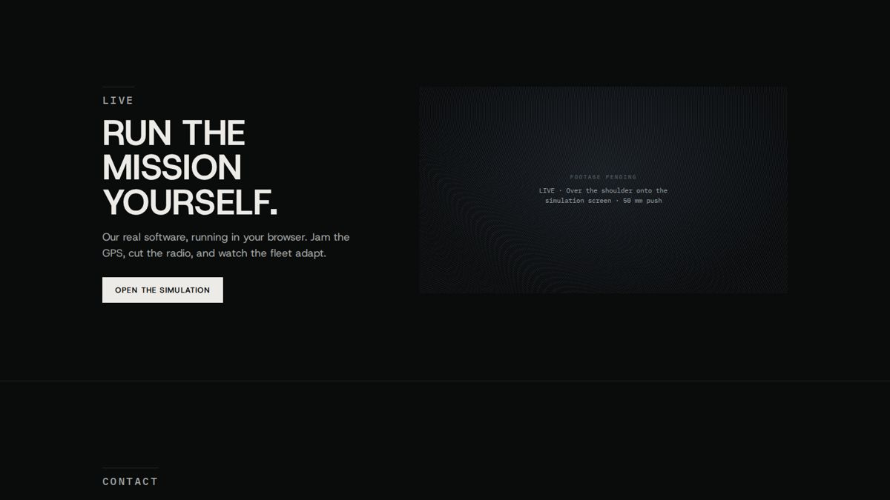

# Review: the cinema branch at each chapter's text frame (2026-10-08)

Captured in Chrome with a real GPU, at 1600×900, scrolled to the middle of each chapter.
- **State:** every shot is still pending, so each frame is a slate with its slug line.
- **One exception, preview only:** SHOT 03 ("One network") played a real Pexels drone plate of Pangong Tso as stand-in
  footage. It shows the film pipeline on real video: 2.39:1 frame, grade, vignette, grain. That stand-in is **not**
  committed: the branch's `media/manifest.json` has every shot `ready: false`.

| Chapter | Shot(s) | Screenshot |
|---|---|---|
| 01 Hero | shot01_hero |  |
| 02 One network | shot03_network (stand-in plate in this preview) |  |
| 03 GPS denied | shot04_gpsdenied |  |
| 04 Comms degraded | shot05_relay |  |
| 05 Asset lost | shot06_lost |  |
| 06 Split and search | shot07_search |  |
| 07 Eyes on the position | shot08a_thermal |  |
| 08 Operator (tasking + decision) | shot02_tasking, shot09_decide |  |
| System cards | card_uav, card_ugv, card_usv, card_eyes |  |
| Live | live_teaser |  |

## QA on this branch (local server, same files)

- **Overlap:** 0 text-on-graphic overlaps at every scroll position at 1440×900, 390×844, 320×568, 667×375 and 1920×1080.
- **Accessibility (axe, WCAG 2.2 AA):** 0 violations at desktop and phone size.
- **Third-party requests:** 0. **Security-policy (CSP) violations:** 0.
- **Lighthouse (mobile):** 100 for performance, accessibility, best practices and SEO; LCP 1.6 s, TBT 0 ms.
  Machines without a GPU (Lighthouse emulates one in software) skip the film shader and show the shot plainly.

## Still open

- **Real footage.** Generate it per `SHOT_LIST.md` and run `tools/encode.sh SHOT FILE` for each delivery; the site
  switches from slate to film automatically.
- **Hero frame-scrub.** Scroll-scrubbing the hero from a frame sequence (for iOS) waits for shot01's footage.
- **Not built yet:**
  - depth-map parallax for stills (needs `*_depth.png` files);
  - heat shimmer behind the turbojet (needs an exhaust mask from the footage).
- **Test matrix.** Safari, Firefox, iOS and Android are not yet tested on real devices. Everything here is Chrome
  plus emulation.
